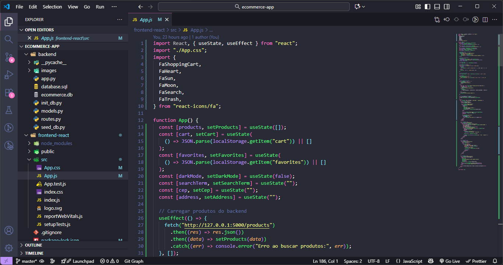

# 🛍️ Techzone Store

## 🇧🇷 Sobre o Projeto

A **Techzone Store** é uma loja virtual moderna e interativa desenvolvida com **React**, simulando a experiência completa de um e-commerce real.  
O projeto foi criado com foco em **performance, design responsivo e experiência do usuário**, sendo ideal para demonstrar minhas habilidades em **desenvolvimento front-end profissional**.

Além disso, este projeto faz parte do meu portfólio como desenvolvedor web, apresentando uma interface fluida e moderna, transições dinâmicas e modo **claro/escuro** para agradar diferentes perfis de usuários.

---

## 🧠 Tecnologias Utilizadas

- ⚛️ **React.js** — construção da interface interativa
- 🎨 **CSS3** — design responsivo e estilização visual
- 💡 **JavaScript (ES6+)** — lógica e interatividade
- 🐍 **Python** — integração e testes de backend (conceitual)

---

## 🌙💡 Modos de Tema

O usuário pode alternar entre os modos **Claro** e **Escuro** com um simples clique, proporcionando uma experiência personalizada e confortável:

**Modo Claro:**  


**Modo Escuro:**  


---

## 🎬 Demonstração em Vídeo

Assista à loja em funcionamento:  
📹 [Clique para assistir ao vídeo](./frontend-react/src/assets/videos/loja.mp4)

Ou visualize o preview abaixo:

<video src="./frontend-react/src/assets/videos/loja.mp4" controls width="700"></video>

---

## 🐍 Ícone de Destaque



---

## 🚀 Como Executar o Projeto

1. **Clone o repositório:**
   ```bash
   git clone https://github.com/williamdev95/techzone-store.git
   ```
   Acesse o diretório do projeto:

cd techzone-store/frontend-react

Instale as dependências:

npm install

Inicie o servidor local:

npm start

O projeto abrirá automaticamente em:

http://localhost:3000

📌 Objetivo do Projeto

Este projeto foi desenvolvido com o objetivo de:

Aprimorar minhas habilidades em React e CSS moderno;

Demonstrar boas práticas de desenvolvimento front-end;

Criar um portfólio visualmente atraente e funcional;

Mostrar domínio em criação de interfaces profissionais voltadas para o usuário.

🌎 English Version
💻 About the Project

Techzone Store is a modern and interactive virtual store built with React, simulating a complete real-world e-commerce experience.
The project focuses on performance, responsive design, and user experience, showcasing my professional front-end development skills.

🧰 Tech Stack

⚛️ React.js — for the interactive interface

🎨 CSS3 — for responsive and modern design

💡 JavaScript (ES6+) — for logic and interactivity

🐍 Python — conceptual backend integration

🌗 Light & Dark Modes

Light Mode:

Dark Mode:

🎥 Video Demo

Watch the demo here: 📹 Click to watch
<video src="./frontend-react/src/assets/videos/loja.mp4" controls width="700"></video>

💬 About the Project

“Techzone Store was developed with passion and dedication to deliver a modern, efficient, and visually engaging experience — a reflection of my journey as a web developer aiming for excellence and creativity.”

📫 Contato / Contact

📧 E-mail: williamcipriano344@gmail.com

💼 LinkedIn: linkedin.com/in/william-cipriano-b44870383

📱 WhatsApp: +55 (11) 99706-1610
📍 Localização: Guarulhos, SP - Brasil

🏁 Conclusão

A Techzone Store representa um marco importante na minha evolução como desenvolvedor — unindo técnica, design e propósito.
Sinta-se à vontade para explorar o código, enviar feedbacks e conectar-se comigo! 🚀

<p align="center"> <b>Feito com ❤️ por <a href="https://www.linkedin.com/in/william-cipriano-b44870383">William Cipriano</a></b><br> <sub>Made with ❤️ in React</sub> </p> ```
