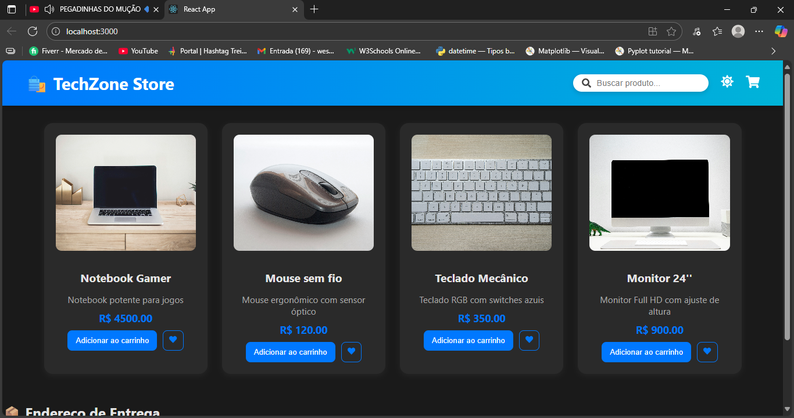
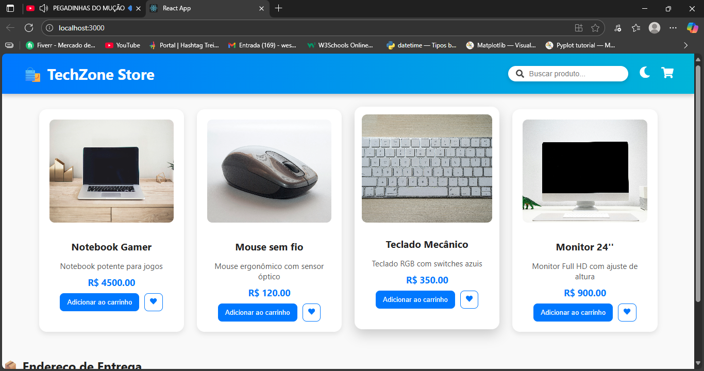

<h1 align="center">🛒 Techzone Store</h1>

<p align="center">
  
</p>

<p align="center">
  <strong>Um e-commerce moderno e responsivo desenvolvido para demonstrar habilidades em desenvolvimento web Full Stack.</strong><br>
  <em>A modern and responsive e-commerce project built to showcase Full Stack web development skills.</em>
</p>

---

## 🚀 Sobre o Projeto | About the Project

**Techzone Store** é uma aplicação de e-commerce que simula uma loja de tecnologia, desenvolvida com foco em boas práticas de **frontend e backend**, desempenho e usabilidade.  
O projeto foi criado para **exposição no portfólio** e demonstração de domínio em **integração entre tecnologias modernas**.

**Techzone Store** is a tech e-commerce simulation focused on clean architecture, performance, and user experience.  
It was built as a **portfolio project** to demonstrate **modern frontend-backend integration**.

---

## 🧩 Tecnologias Utilizadas | Technologies Used

### 💻 Frontend

- React.js ⚛️
- HTML5 & CSS3 🎨
- JavaScript (ES6+) 🧠

### ⚙️ Backend

- Python 🐍
- Flask 🌐
- SQLite 🗃️

### 📦 Outras Ferramentas

- Git & GitHub 🔧
- NPM & Node.js 📦
- VS Code 💡

---

## 🖼️ Demonstração | Demo

### 🖥️ Interface

<p align="center">
  
</p>

### 🎥 Vídeo de Demonstração | Demo Video

<p align="center">
  <video src="frontend-react/src/assets/videos/loja.mp4" width="80%" controls></video>
</p>

---

## 📁 Estrutura do Projeto | Project Structure

ecommerce-app/
│
├── backend/ # API Flask + Banco de Dados SQLite
│ ├── app.py
│ ├── models.py
│ ├── routes.py
│ └── ...
│
├── frontend-react/ # Aplicação React
│ ├── src/
│ │ ├── assets/
│ │ │ ├── images/
│ │ │ └── videos/
│ │ ├── App.js
│ │ ├── App.css
│ │ └── ...
│ ├── package.json
│ └── ...
│
└── README.md

---

## ⚙️ Como Executar | How to Run

### 🔧 Backend (Flask)

```bash
cd backend
python app.py
```

💻 Frontend (React)

cd frontend-react
npm install
npm start

Acesse em http://localhost:3000

Access it at http://localhost:3000

🌟 Recursos | Features

Interface moderna e responsiva 💡

Alternância de tema (claro/escuro) 🌗

Integração com API Flask 🔄

Exibição dinâmica de produtos 🛍️

Código limpo e modular ✨

👨‍💻 Desenvolvido por | Developed by

William Cipriano
📍 São Paulo, Brasil 🇧🇷

📧 E-mail: williamcipriano344@gmail.com

💼 LinkedIn: linkedin.com/in/william-cipriano-b44870383

💻 GitHub: github.com/williamdev95

📱 WhatsApp: +55 (11) 99706-1610

<p align="center">✨ Projeto criado com dedicação, aprendizado contínuo e foco em qualidade profissional ✨</p> ```
